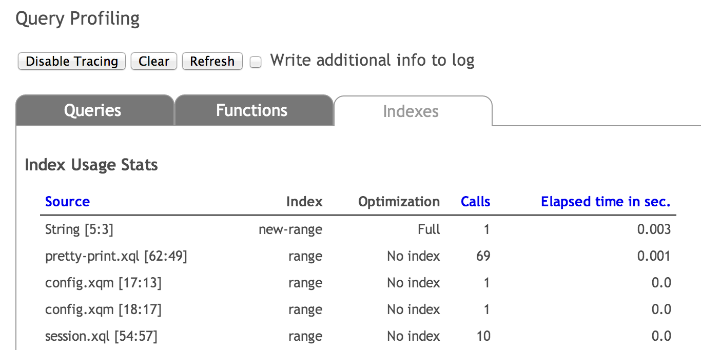

# Configuring Database Indexes

## Overview

In this section, we discuss the types of database indexes used by eXist-db, as well as how they are created, configured and maintained. It assumes readers have a basic understanding of XML and XQuery.

Database indexes are used extensively by eXist-db to facilitate efficient querying of the database. This is accomplished both by system-generated and user-configured database indexes. The current (2.2) version of eXist-db by default includes the following types of indexes:

> **Note**
>
> Properly configured indexes have a huge impact on database performance! Some expressions might run a hundred times faster with an index. This is particular applies to the range index: without a range index, eXist has to do a full scan over the context nodes to look up an element value, which severly limits performance and scalability.

1.  *[New Range Indexes](newrangeindex.md)*: A rewritten range index which provides superior performance on large data sets.

2.  *[Full Text Indexes](lucene.md)*: This full text indexing module features faster and customizable full text indexing by transparently integrating Lucene into the XQuery engine. Prefer this index over the Legacy Full Text Index.

3.  *[Legacy Range Indexes](oldrangeindex.md)*: These map specific text nodes and attributes of the documents in a collection to typed values.

4.  *[Legacy Full Text Indexes](ftlegacy.md)*: These map specific text nodes and attributes of the documents in a collection to text tokens.

5.  *[NGram Indexes](ngram.md)*: These map specific text nodes and attributes of the documents in a collection to splitted tokens of n-characters (where n = 3 by default). This is very efficient for exact substring searches and for queries on scripts (mostly non-European ones) which can not be easily split into whitespace separated tokens and are thus a bad match for the Lucene full text index.

6.  *[Spatial Indexes](devguide_indexes.md#spatial) (Experimental)*: A working proof-of-concept index, which listens for spatial geometries described through the Geography Markup Language (GML). A detailed description of the implementation can be found in the [Developer's Guide to Modularized Indexes](devguide_indexes.md#spatial).

7.  *xml:id Index*: An index of all xml:id attribute values is automatically created. These values can be queried by fn:id().

8.  *[Structural Indexes](#structuralidx)*: This index keeps track of the elements, attributes, and the nodal structure of all XML documents in a collection. It is created and maintained automatically. No configuration required.

eXist-db features a modularized indexing architecture. Most types of indexes have been moved out of the database core and are now maintained as pluggable extensions. The full text, the ngram, the spatial and the new range indexes fall under this category.

## Configuring Indexes

eXist-db has no "create index" command. Instead, indexes are configured in collection-specific configuration files. These files are stored as standard XML documents in the system collection: `/db/system/config`, which can be accessed like any other document (e.g. using the Admin interface or Java Client). In addition to defining settings for indexing collections, the configuration document specifies collection-specific other settings such as triggers or default permissions.

The contents of the system collection (`/db/system/config`) should mirror the hierarchical structure of the main collection. Configurations are shared by descendants in the hierarchy unless they have their own configuration (i.e. the configuration settings for the child collection override those set for the parent). If no collection-specific configuration file is created for any document, the global settings in the main configuration file, `conf.xml`, will apply by default. That being said, the `conf.xml` file should only define the default global *index creation policy*.

To configure a given collection - e.g. `/db/foo` - create a file `collection.xconf` and store it as `/db/system/config/db/foo/collection.xconf`. Note the replication of the `/db/foo` hierarchy inside `/db/system/config/`. Subcollections which do not have a `collection.xconf` file of their own will be governed by the configuration policy specified for the closest ancestor collection which does have such a file, so you are not required to specify a configuration for every collection. Note, however, that configuration settings do not cascade. If you choose to deploy a `collection.xconf` file in a subcollection, you must specify in that file *all* the configuration options you wish to have applied to that subcollection (and any lower-level subcollections without `collection.xconf` files of their own).

> **Note**
>
> Due to backward compatibility concerns, the file does not have to be called `collection.xconf`, which is now the preferred file name, but it *must* have the `.xconf` extension.
>
> You can only have *one* `.xconf` file at each level.

### Maintaining Indexes and Re-indexing

The eXist-db index system automatically maintains and updates indexes defined by the user. You therefore do not need to update an index when you update a database document or collection. eXist-db will even update indexes following partial document updates via *XUpdate* or *XQuery Update* expressions.

The only exception to eXist-db's automatic update occurs when you *add a new index definition to an existing database collection*. In this case, the new index settings will *only* apply to new data added to this collection, or any of its sub-collections, and *not* to previously existing data. To apply the new settings to the entire collection, you need to trigger a "manual reindex" of the collection being updated. You can re-index collections using the Java Admin Client (shown on the right). From the Admin menu, select File » Reindex Collection.

You can also index by passing an XQuery to eXist-db:                                                                                                                                                                                                            ```xquery
xmldb:reindex('/db/foo')                                                                                                        ```

### General Configuration Structure and Syntax

Index configuration files are standard XML documents that have their elements and attributes defined by the eXist-db namespace:

http://exist-db.org/collection-config/1.0
The following example shows a configuration example:

                            
    <collection xmlns="http://exist-db.org/collection-config/1.0">
        <index>
            <!-- Full text index based on Lucene -->
            <lucene>
                <text qname="SPEECH">
                    <ignore qname="SPEAKER"/>
                </text>
                <text qname="TITLE"/>
            </lucene>
            
            <!-- Range indexes -->
            <range>
                <create qname="title" type="xs:string"/>
                <create qname="author" type="xs:string"/>
                <create qname="year" type="xs:integer"/>
            </range>

            <!-- N-gram indexes -->
            <ngram qname="author"/>
            <ngram qname="title"/>
        </index>
    </collection>

                        

All configuration documents documents have an index element directly below the root element, which encloses the index configuration. Only *one* index element is permitted in a document. Apart from the index configuration, the document may also contain settings not related to indexing, e.g. for triggers; these will not be covered here.

In the index element are elements that define the various index types. Each index type can add its own configuration elements, which are directly forwarded to the corresponding index implementation. The example above configures three different types of indexes: full text, range and ngram.

#### Namespaces

If the document to be indexed uses namespaces, you should add a `xmlns` declaration for each of the required namespaces to the index element:

                                
    <collection xmlns="http://exist-db.org/collection-config/1.0">
        <index xmlns:atom="http://www.w3.org/2005/Atom">
            <fulltext default="none" attributes="no">
                <create qname="atom:title"/>
            </fulltext>
            <range>
                <create qname="atom:id" type="xs:string"/>
            </range>
        </index>
    </collection>

                            

The example configuration above creates two indexes on a collection of atom documents. The two elements which should be indexed are both in the `atom` namespace and we thus need to declare a mapping for this namespace. Please note that the `xmlns` namespace declarations have to be specified on the index element, not the create or fulltext elements.

## Check Index Usage

The quickest way to see if an index was used or not is to go to the Profiling menu item in the [Monex Monitoring and Profiling application]({monex}).

Click on Enable Tracing to enable usage statistics.

Run the query you would like to profile. The profiler will collect statistics about any query running on the database instance, no matter how the query is called.

Click Refresh and switch to the Indexes tab.



The table provides the following information:

| --- | --- |
| Source | The query containing the expression. The line/column of the expression is given in brackets. For queries stored in the database, the file name will be shown. Dynamically executed queries are displayed with the name "String".
| Index | Type of the index used: "range" for the old range index, "new-range" for the new range index, "lucene" for the full text index. |
| Optimization | Either "Full", "Basic", or "No index". The meaning of those labels is as follows:- "Full": the expression was rewritten by the optimizer to make full use of the index. This is the best you can achieve.<br>- "Basic": the index was used, but the expression was not rewritten by the optimizer. This is better than "No index" but still several times slower than "Full". Most probably the context of the expression was too complex to rewrite it.<br>- "No index": no index defined.  Expression is evaluated in "brute force" mode. |
| Calls | The number of calls to the expression. |
| Elapsed time | The time elapsed for all calls together. The time is measured for the index lookup only. The absolute numbers are not reliable (due to measurement errors), but they show a tendency: if a lookup takes relatively longer than other expressions, it might be worth to optimize it with an index. |

## Enabling Index Modules

While some indexes (n-gram, full text) are already pre-build in the standard eXist-db distribution, other modules may need to be enabled first. For example, the spatial index depends on a bunch of external libraries, which do not ship with eXist-db. However, enabling the spatial index is a simple process:

Copy the properties file `extensions/indexes/build.properties` and store it as `local.build.properties` in the same directory if it does not already exist.

Edit `extensions/indexes/local.build.properties`:

    # N-gram module
    include.index.ngram = true

    # Spatial module
    include.index.spatial = false
                            

To include an index, change the corresponding property to "true".

Call the Ant build system once to regenerate the eXist-db libraries:

build.sh
or

build.bat
The build process should create a jar file for every index implementation in directory `lib/extensions`. For example, the spatial index is packaged into the jar `exist-spatial-module.jar`.

Once the index module has been built, it can be announced to eXist-db. To activate an index plugin, it needs to be added to the modules section within the global configuration file `conf.xml`:

                        <modules>
        <module id="ngram-index" class="org.exist.indexing.ngram.NGramIndex"
            file="ngram.dbx" n="3"/>
        <!-- The full text index is always required and should
             not be disabled. We still have some dependencies on
             this index in the database core. These will be removed
             once the redesign has been completed. -->
        <module id="ft-legacy-index" class="org.exist.fulltext.FTIndex"/>
    </modules>
                    

Every module element needs at least an `id` and `class` attribute. The class attribute contains the name of the plugin class, which has to be an implementation of `org.exist.indexing.Index`.

All other attributes or nested configuration elements below the module element are specific to the implementation and will differ between indexes. They should be documented by the index implementor.

If an index implementation cannot be loaded from the specified class, the entry will simply be ignored. A warning will be written to the logs which should provide more information on the issue which caused the configuration to fail.

## Automatic Indexes

### Structural index

This index keeps track of the elements (tags), attributes, and nodal structure for all XML documents in a collection. It is created and maintained automatically in eXist-db, and can neither be reconfigured nor disabled by the user. The structural index is required for nearly all XPath and XQuery expressions in eXist-db (with the exception of wildcard-only expressions such as "`//*`"). This index is stored in the database file `elements.dbx`.

Technically, the structural index maps every element and attribute *qname* (or *qualified name*) in a document collection to a list of documentId, nodeId pairs. This mapping is used by the query engine to resolve queries for a given XPath expression.

For example, given the following query:

//book/section
eXist-db uses two index lookups: the first for the book node, and the second for the section node. It then computes the *structural join* between these node sets to determine which section elements are in fact children of book elements.
